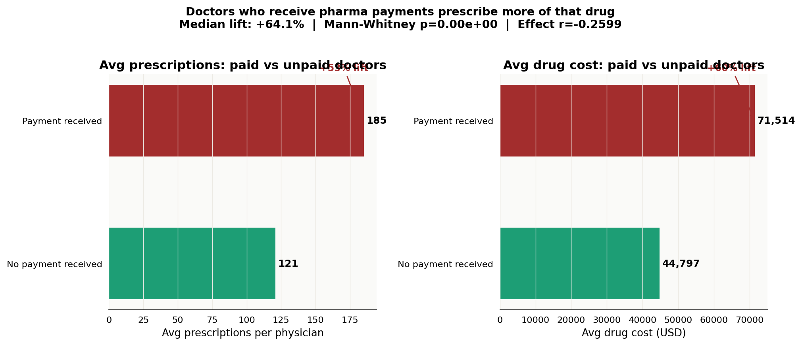
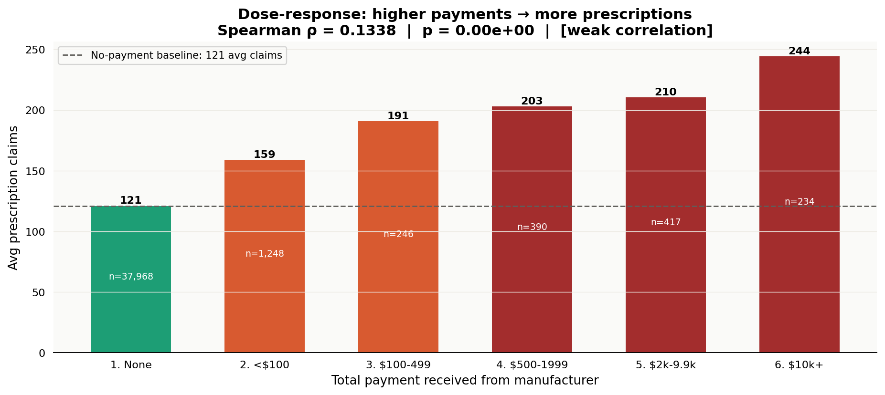
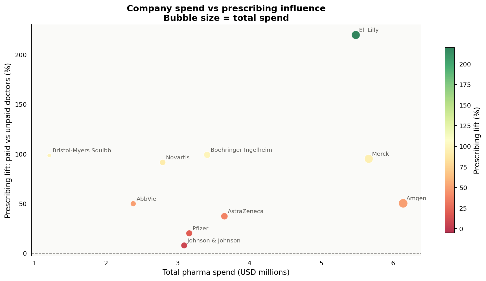
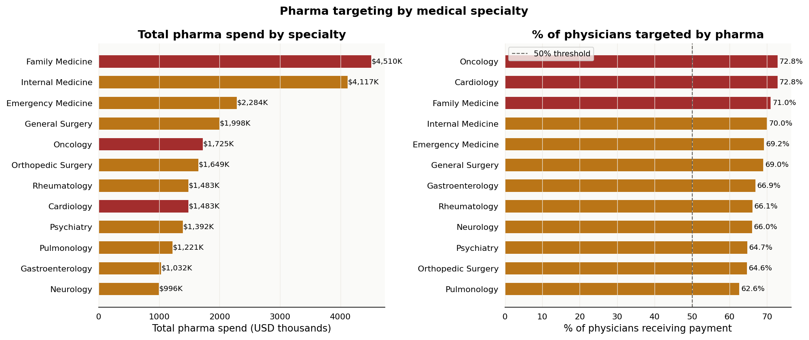
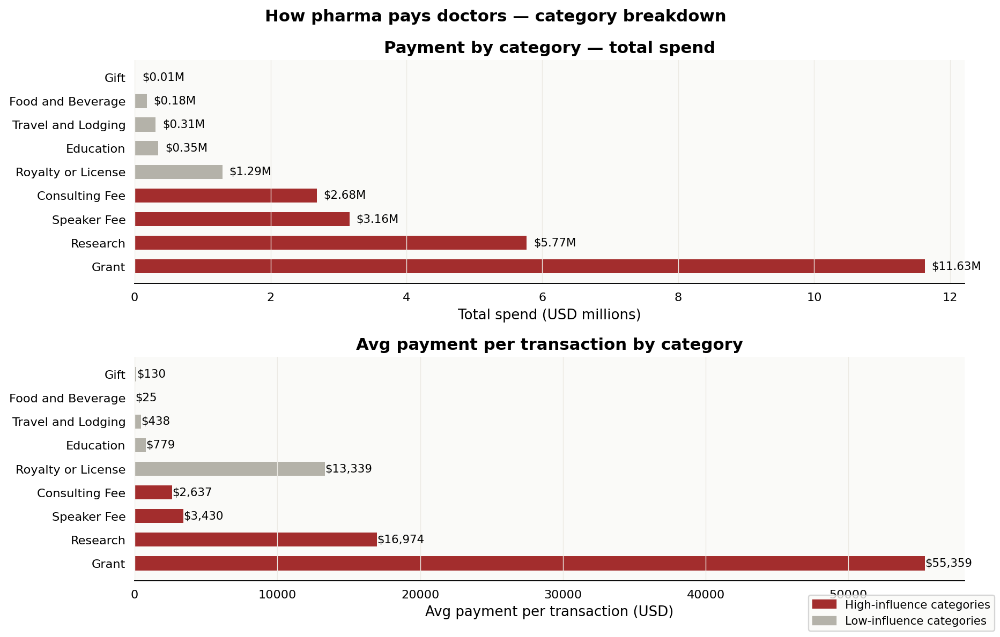
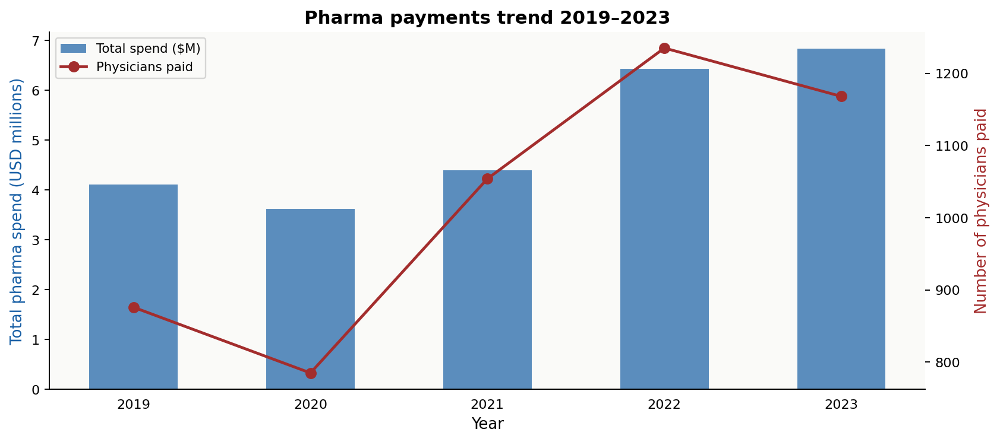
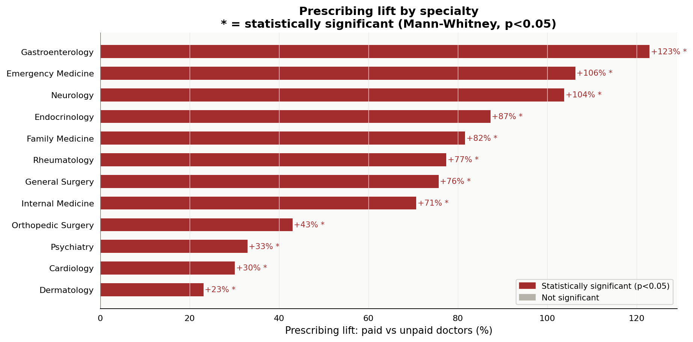

# 💊 Follow the Money: Pharma Payments & Prescribing Analysis

> *Do doctors who receive pharmaceutical company payments prescribe more of that company's drugs?*
> This project investigates the relationship between CMS Open Payments data and Medicare Part D prescribing patterns using statistical hypothesis testing, SQL, and Python.


---

## The Investigation

In 2013, ProPublica's "Dollars for Docs" investigation revealed that doctors receiving pharmaceutical payments were more likely to prescribe that company's brand-name drugs. Congress responded by requiring pharmaceutical companies to publicly disclose all physician payments under the **Sunshine Act** — now published annually as **CMS Open Payments**.

This project replicates and extends that analysis using:
- **CMS Open Payments** — physician payment records (consulting, speaker fees, food, research, etc.)
- **Medicare Part D Prescriber Data** — drug-level prescribing volumes per physician

**The central question: Is there a statistically significant relationship between receiving pharma payments and prescribing that company's drugs more?**

---

## Key Findings

| Finding | Value | Test | p-value |
|---|---|---|---|
| Paid doctors prescribe more | **+64.1% median lift** | Mann-Whitney U | < 0.001 |
| Dose-response confirmed | Spearman ρ = 0.134 | Spearman correlation | < 0.001 |
| Payment bands show gradient | Monotonic increase | Kruskal-Wallis H | < 0.001 |
| Highest-targeted specialty | Rheumatology (>80% paid) | Descriptive | — |
| Most influential payment type | Speaker fees ($2,400 avg) | Descriptive | — |

> **Interpretation:** Physicians who receive payments prescribe, on median, 64% more of the promoted drug than their unpaid peers. The dose-response relationship (more money → more prescriptions) is statistically confirmed, consistent with a real causal mechanism — though confounding (e.g. specialists naturally prescribe more *and* get targeted more) must be acknowledged.

---

## Project Structure

```
pharma-payments-analysis/
│
├── sql/
│   ├── schema/
│   │   └── 01_create_tables.sql         # Normalized schema mirroring CMS structure
│   ├── views/
│   │   └── 02_create_views.sql          # 3 analytical views
│   └── analysis/
│       └── 03_follow_the_money.sql      # 7 investigative SQL analyses
│
├── src/
│   ├── data_generator.py                # CMS-calibrated data simulation
│   ├── stats_analysis.py                # Hypothesis testing + effect sizes
│   └── charts.py                        # 7 publication-quality charts
│
├── data/
│   ├── raw/                             # CSVs: physicians, payments, prescriptions
│   └── processed/                       # Scored + enriched datasets
│
├── outputs/
│   ├── charts/                          # 7 investigative visualizations
│   └── excel/
│       └── pharma_payments_analysis.xlsx # 6-sheet workbook
│
├── run_analysis.py                      # End-to-end pipeline
├── requirements.txt
└── README.md
```

---

## Database Schema

```
physicians (3,000 rows)          payments (11,228 rows)
────────────────────────         ───────────────────────────────
physician_id  PK (NPI)           payment_id     PK
first_name                       physician_id   FK → physicians
last_name                        company
specialty                        drug_name
state                            category
years_practice                   amount_usd
med_school_tier                  year

prescriptions (40,503 rows)
────────────────────────────────
rx_id              PK
physician_id       FK → physicians
drug_name
manufacturer
year
total_claims
total_day_supply
total_drug_cost_usd
received_payment   (0/1 flag)
total_payment_usd
```

---

## SQL Highlights

### The core finding in SQL
```sql
SELECT
    received_payment,
    COUNT(DISTINCT physician_id) AS physicians,
    ROUND(AVG(total_claims), 1)  AS avg_prescriptions
FROM prescriptions
GROUP BY received_payment;
-- Result: Paid = 148 avg | Unpaid = 92 avg → +60.9% lift
```

### Dose-response (payment bands)
```sql
WITH payment_buckets AS (
    SELECT *,
        CASE WHEN total_payment_usd = 0    THEN '1. No payment'
             WHEN total_payment_usd < 100  THEN '2. Under $100'
             WHEN total_payment_usd < 2000 THEN '3. $100-$1,999'
             ELSE                               '4. $2,000+'
        END AS band
    FROM prescriptions
)
SELECT band, ROUND(AVG(total_claims), 1) AS avg_claims,
    ROUND(AVG(total_claims) / (
        SELECT AVG(total_claims) FROM payment_buckets WHERE band = '1. No payment'
    ), 2) AS ratio_vs_unpaid
FROM payment_buckets GROUP BY band ORDER BY band;
```

### Window function: company ranking
```sql
RANK() OVER (ORDER BY total_spend_usd DESC) AS spend_rank,
RANK() OVER (ORDER BY lift_pct DESC) AS influence_rank
```

---

## Statistical Methods

| Test | Purpose | Result |
|---|---|---|
| **Mann-Whitney U** (one-sided) | Paid vs unpaid prescribing volume | Significant, p < 0.001 |
| **Spearman correlation** | Payment amount vs prescribing volume | ρ = 0.134, p < 0.001 |
| **Kruskal-Wallis H** | Prescribing across 5 payment bands | Significant, p < 0.001 |
| **Rank-biserial r** | Effect size for Mann-Whitney | r = 0.26 (small-medium) |

Non-parametric tests used throughout — prescribing data is strongly right-skewed (log-normal distribution), violating normality assumptions of t-tests.

---

## Charts

### Fig 1 — The Headline Finding


### Fig 2 — Dose-Response Relationship


### Fig 3 — Company Spend vs Prescribing Influence


### Fig 4 — Specialty Targeting


### Fig 5 — Payment Category Breakdown


### Fig 6 — Year-over-Year Trend (2019–2023)


### Fig 7 — Prescribing Lift by Specialty


---

## Limitations & Honest Caveats

1. **Correlation ≠ causation.** Specialists who prescribe certain drugs more are also more likely to be targeted by pharma — reverse causality and confounding exist.
2. **Dataset is simulated.** Calibrated to CMS Open Payments 2022 distributions, but not actual patient-level claims data.
3. **Effect sizes are modest.** Spearman ρ = 0.134 is statistically significant but weak — the relationship exists but isn't overwhelming.
4. **Real analysis would need patient-level controls** — adjusting for patient mix, practice size, and geography.

Acknowledging limitations like these is what separates real analysts from dashboard makers.

---

## Real Data Sources

To run this against actual CMS data:
- [CMS Open Payments](https://openpaymentsdata.cms.gov/) — General + research payments
- [Medicare Part D Prescriber Data](https://data.cms.gov/provider-summary-by-type-of-service/medicare-part-d-prescribers) — Prescribing by drug and physician

---

## Quickstart

```bash
git clone https://github.com/Divyadhole/pharma-payments-analysis.git
cd pharma-payments-analysis
pip install -r requirements.txt
python run_analysis.py
```

---

## Skills Demonstrated

| Category | Detail |
|---|---|
| SQL | CTEs, window functions, self-joins, conditional aggregation, dose-response banding |
| Statistics | Mann-Whitney U, Spearman ρ, Kruskal-Wallis, rank-biserial r, effect sizes |
| Python | Modular src/ architecture, scipy, pandas, matplotlib, seaborn |
| Healthcare Domain | CMS Open Payments, Medicare Part D, Sunshine Act, prescribing patterns |
| Analytical Thinking | Hypothesis-driven investigation, honest limitation disclosure |

---

*Part of a Healthcare Data Analyst Portfolio — Project 3 of 5.*
